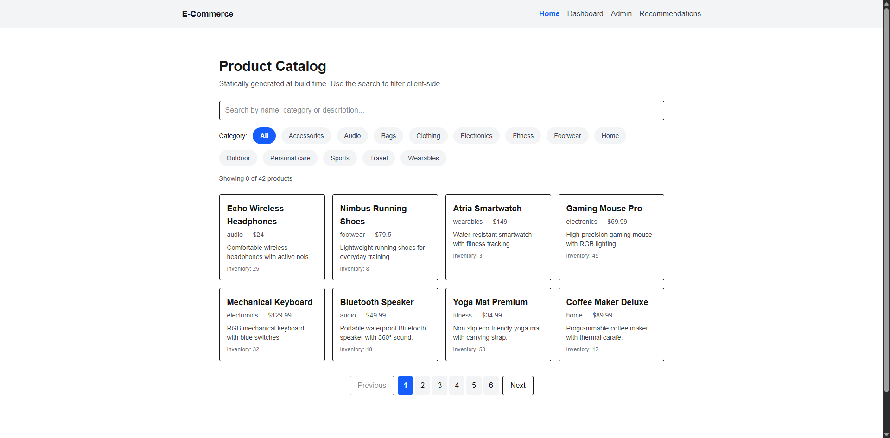

# E-Commerce Sample (Next.js App Router)

<p align="center">
  
</p>

This repository is a small e-commerce-style demo that implements different Next.js rendering strategies (SSG, ISR, SSR, Client-side) and provides simple API routes backed by a JSON file.

Author: Shakshi Patel
Date: 2025-10-28

## Features

- Home page (`/`) — Product list statically generated at build time (SSG). Client-side search is enabled.
- Product details (`/products/[slug]`) — Pre-generated pages with ISR (revalidate every 60 seconds).
- Inventory Dashboard (`/dashboard`) — Server-side rendered on every request (SSR) to show live inventory stats.
- Admin Panel (`/admin`) — Client-side app using fetch to call API endpoints for creating/updating products. Write endpoints require an admin key header `x-admin-key`.
- Recommendations (`/recommendations`) — Server component rendering recommendations with a client-side `WishlistButton`.
- API endpoints under `/api/products` for GET (all), GET by slug, POST (create), and PUT (update by id). Writes are protected by an admin key.

## Getting started

1. Install dependencies:

```bash
npm install
```

2. Create a `.env.local` file based on `.env.example` and set a value for `ADMIN_KEY`.

3. Run the dev server:

```bash
npm run dev
```

App will be available at http://localhost:3000

## Data

The project uses a file `data/products.json` as a mock database. API routes read and write this file. For production or scale, replace this with MongoDB or another DB.

## Notes on rendering strategies

- Home: Using a build-time import of `data/products.json` makes the page static (SSG) — fast and appropriate for catalog browsing.
- Product detail: `revalidate = 60` enables ISR so pages are regenerated in the background every 60 seconds.
- Dashboard: Marked `force-dynamic` so the server fetches the latest inventory on every request (SSR) — suitable for live stats.
- Admin: Uses client-side rendering to allow interactive forms and calls to the backend API.

## API

- GET /api/products — list products
- GET /api/products/[slug] — single product
- POST /api/products — create product (requires header `x-admin-key`)
- PUT /api/products/[id] — update product (requires header `x-admin-key`)

## Run build / tests

```bash
npm run build
npm run start
```

## Environment

Copy `.env.example` to `.env.local` and set `ADMIN_KEY` before running admin write actions.
